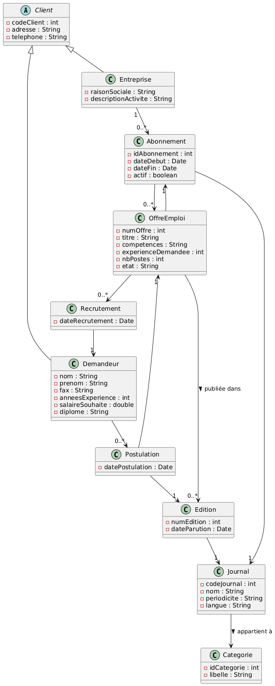
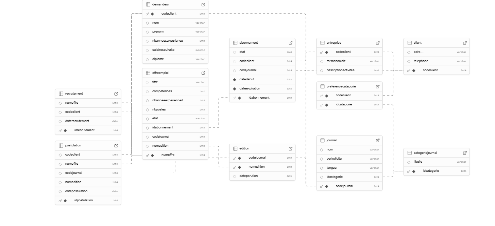

# Projet Agence de Recrutement

## 📌 Description
Ce projet est une application desktop réalisée en Java Swing dans le cadre d'un projet universitaire. Elle vise à moderniser le système de gestion d'une agence de recrutement auparavant basé sur des journaux papier. L'application permet la gestion complète du processus de recrutement, de la publication d'offres jusqu'au suivi des recrutements.


## ⚙️ Fonctionnalités principales

### 👨‍💼 Pour les entreprises :
- Création, modification et suppression des offres d'emploi
- Gestion des abonnements aux journaux et éditions
- Consultation des candidatures reçues et filtrage des postulants
- Recrutement et historique des embauches
- Gestion du profil entreprise

### 👨‍💻 Pour les demandeurs d'emploi :
- Inscription avec informations complètes (diplôme, expérience, etc.)
- Consultation des offres d'emploi disponibles
- Postulation en ligne (avec édition consultée)
- Suivi des candidatures
- Interface intuitive avec filtrage par compétences


## 🏗️ Architecture


*Diagramme UML de l'architecture système*

### 🛠️ Technologies Utilisées

<div align="center">


</div>

### 📐 Patterns et Principes
- **DAO Pattern** : Accès aux données structuré
- **Modularité** : Séparation claire entre UI, logique métier et persistance
- **JDBC** : Connectivité base de données
- **Exception Handling** : Gestion robuste des erreurs

## 📁 Structure du Projet

```
📦 Agence-Recrutement/
├── 📁 .vscode/                    # Configuration VS Code
├── 📁 imgs/                       # Images et captures d'écran
│   ├── db.jfif                    # Structure base de données
│   ├── imag                       # Interface principale
│   └── uml_diagram.png            # Diagramme UML
├── 📁 lib/                        # Bibliothèques externes
│   ├── db.sql                     # Script de création BDD
│   └── postgresql-42.7.5.jar     # Driver PostgreSQL
├── 📁 src/                        # Code source principal
│   └── 📁 main/
│       └── 📁 java/
│           ├── 📁 DAO/            # Data Access Objects
│           ├── 📁 models/         # Modèles de données
│           ├── 📁 ui/             # Interfaces utilisateur
│           ├── 📁 utils/          # Utilitaires
├── hs_err_pid21900.log           # Log des erreurs
└── README.md                     # Documentation
```

### 🗂️ Organisation des Packages

- **`DAO/`** : Couche d'accès aux données (CRUD operations)
- **`models/`** : Entités métier (Client, Entreprise, Demandeur, etc.)
- **`ui/`** : Interfaces graphiques Swing
- **`utils/`** : Classes utilitaires et helpers
- **Entreprise** : gestion des offres, abonnements, recrutements  
- **Demandeur** : gestion des profils, postulations  
- **Journal / Édition** : gestion des éditions de journaux par catégorie  
- **Recrutement** : sélection des candidats, historique  
- **Postulation** : candidatures filtrées automatiquement selon profil

---

## 🛢 Base de données


*Aperçu de la structure de la base de données*

- Tables principales :  
  `client`, `entreprise`, `demandeur`, `journal`, `categorie`, `edition`, `abonnement`, `offre`, `postulation`, `recrutement`  
- Relations et contraintes respectées selon le diagramme UML  
- Stockée et gérée via **Supabase Postgres**

---

## 🧪 Tests et Validation


Des scénarios de test ont été mis en place :
- Création de comptes
- Abonnements aux journaux
- Emission et désactivation d'offres
- Postulations avec filtrage par expérience
- Gestion du recrutement jusqu'à désactivation automatique des offres
- Historique de recrutements et cohérence des données

**Résultats :**
- Aucune erreur critique rencontrée
- Interface ergonomique
- Fonctionnalités validées avec succès

---

## 🐞 Problèmes rencontrés
- Duplicatas dans les abonnements → correction via contrôles SQL  
- Postulation multiple à une même offre → vérification d'unicité  
- Dépassement du nombre de recrutements → contrôle du quota  
- Rafraîchissement des listes Swing → automatisé après chaque action

---

## 🚀 Perspectives
- Passage à une interface web (React, Next.js)  
- Notifications des utilisateurs (offres et recrutements)  
- Moteur de recherche plus avancé  
- Déploiement complet cloud (Heroku, Vercel)  
- Authentification sécurisée (JWT, OAuth)

---

## 📦 Installation et Exécution

1. Cloner le projet :
   ```bash
   git clone https://github.com/MouadSadik/recrutement.git
   ```

2. Ouvrir le projet dans un IDE Java (IntelliJ, VsCode, Eclipse)

3. Exécuter le fichier `ClientUI.java` pour lancer l'application

---

## 👥 Auteurs
- **Mouad Sadik**
- **Badreddine Ziane**  
- **Mohcine Elhakmaoui**
- **Ali Tahiri**

**Encadrant :** Mr. Said El Kafhali  
**Année universitaire :** 2024–2025

---

